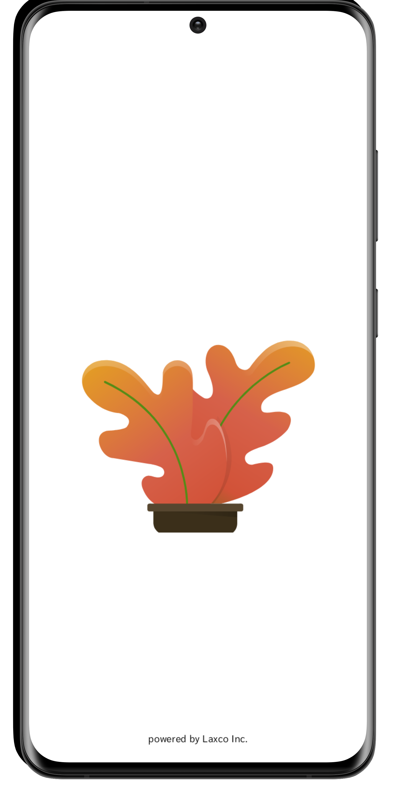
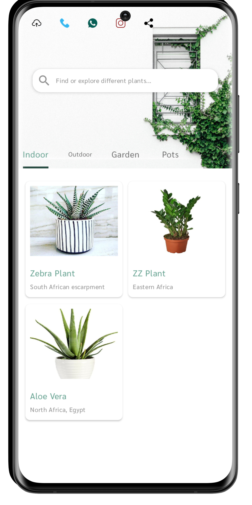
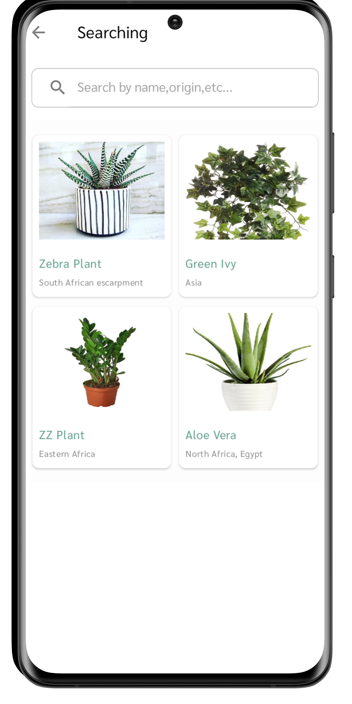
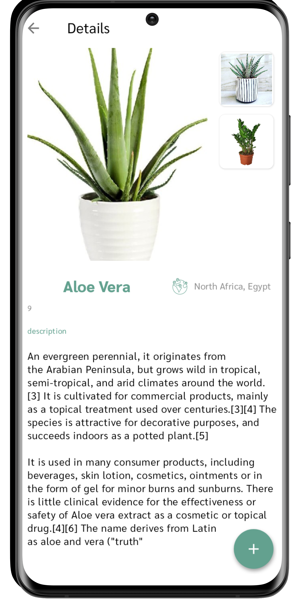

# Screenshots

   

# Flory
Gardening flowers for sale app
Mobile Apps are making shopping easier than ever. It’s no surprise that m-Commerce (mobile commerce) businesses all over the world are adopting mobile Apps to improve their sales and increase customer loyalty. The world is turning mobile, and it’s happening fast.

Florists are just one type of m-Commerce business that can benefit from an App. Florist Apps can include features that allow customers to shop effortlessly. They can browse products and find the perfect gift. They can order and pay, join loyalty schemes and receive Push Notifications with relevant and timely messages.

# Products & Shopping
With an App for a flower shop, you can list all of your products, whether it’s baskets, bouquets or smaller, more simple arrangements. You can list unlimited products, so just keep adding as new products and flowers come in!

# Products
The Product Shopping module provides a full m-commerce shopping experience for your App users. You can upload your entire inventory and categorise your flowers and arrangements by type, occasion, size or price and include beautiful images and descriptions.

Allow your customers to shop effortlessly. They can browse, add to cart and checkout with PayPal, or your own web e-commerce solution. Save payment details securely in the App for easy payment the next time they buy from you.

Make use of Push Notifications
You can use Push Notifications in a number of ways. I’m going to explain what the following words mean; geo-fencing, scheduling and targeting, and how you can use them to improve your mobile App and business marketing strategy.

# Geo-fencing
This feature can be used in many different ways. But i’ll just give you the main ways you can make use of it. With this feature, you can set specific predefined geographical areas in which to send messages to your app user’s phones. In very basic terms, draw a circle around an area and send messages only to those who walk into it.

Use geofencing to send Push Notifications to App users when they walk by your shop, or even walk by your competitor’s shops! Inform them of your new flowers and arrangements. Send messages that could remind users of any birthdays, anniversaries or other special occasions they have coming up.
